## Первый запуск

---

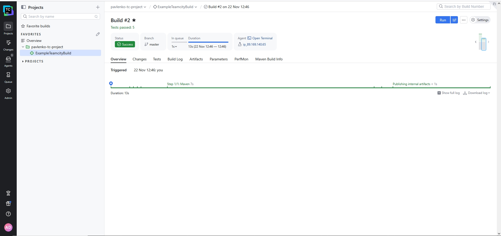

## Первый build ветки master

---

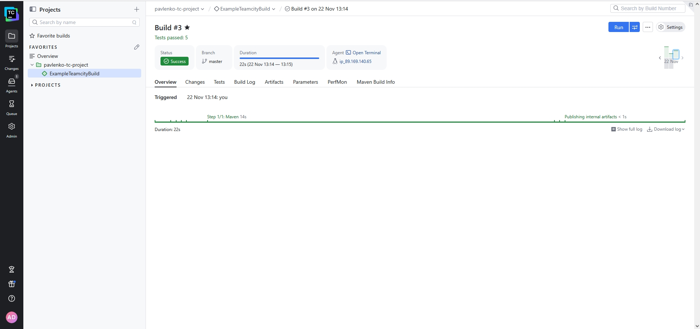
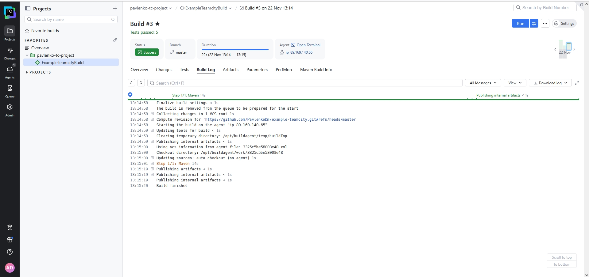

## Первый build ветки feature после добавления метода и теста на него

---

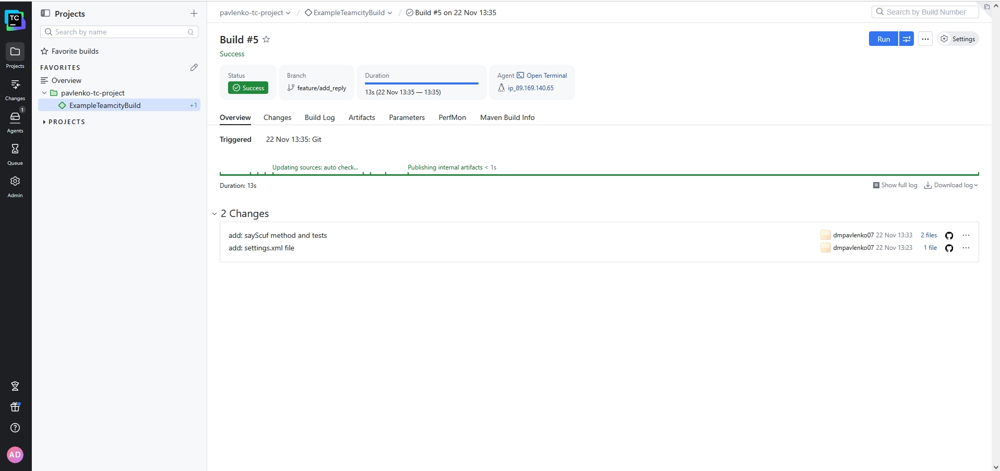
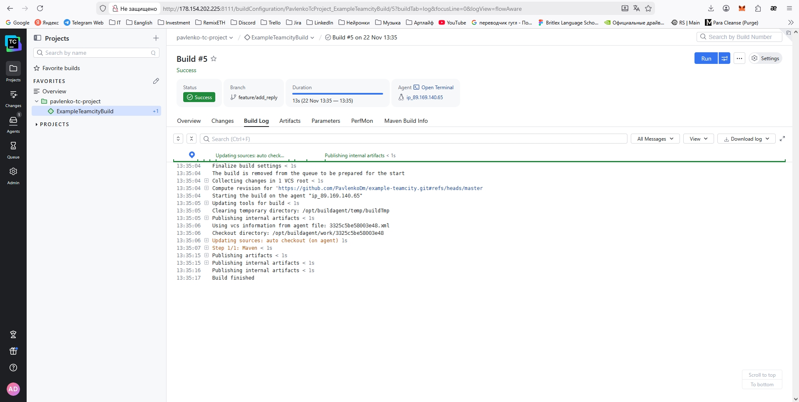

## Ошибка build ветки master после merge

---

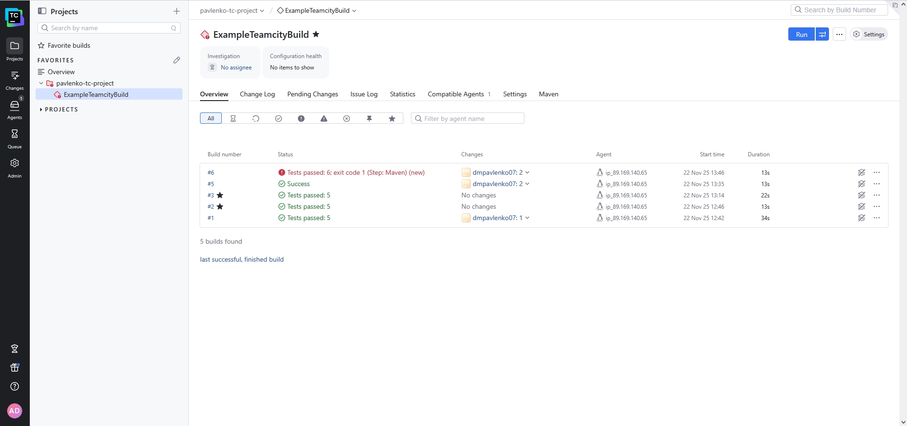
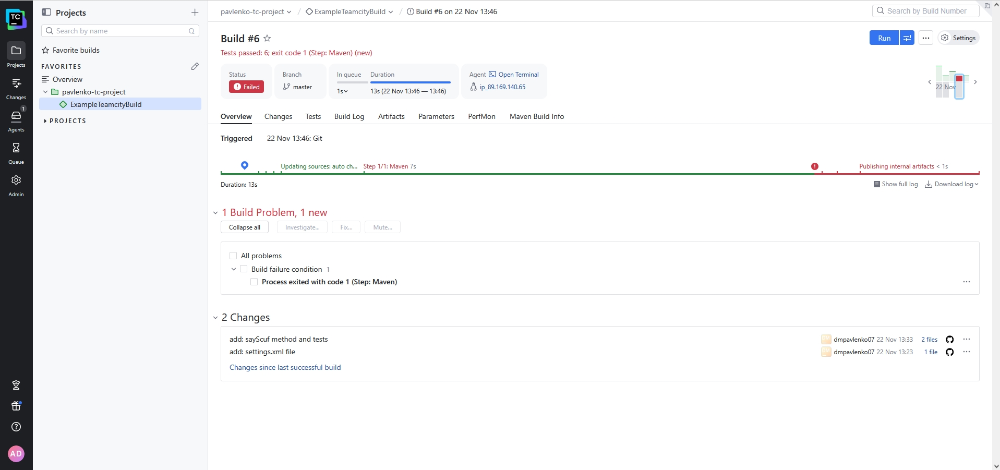
Ошибка произошла по причине не изменения версии артефакта. Nexus заблокировал перезапись.

## Успех build ветки master после merge

---

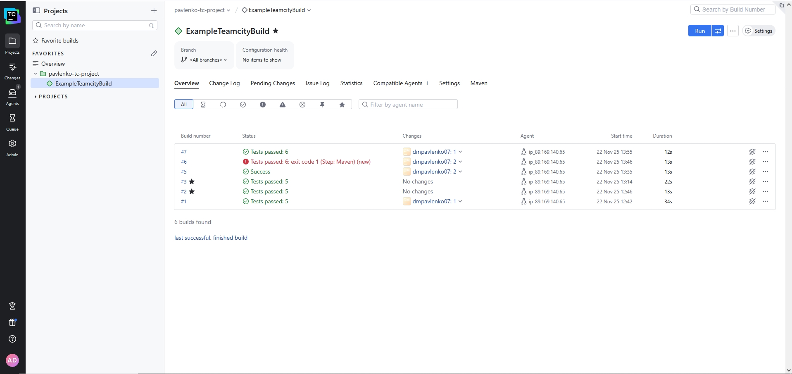
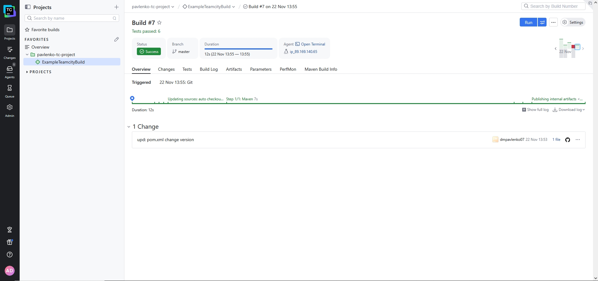
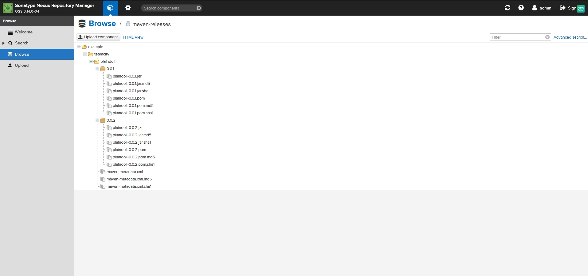
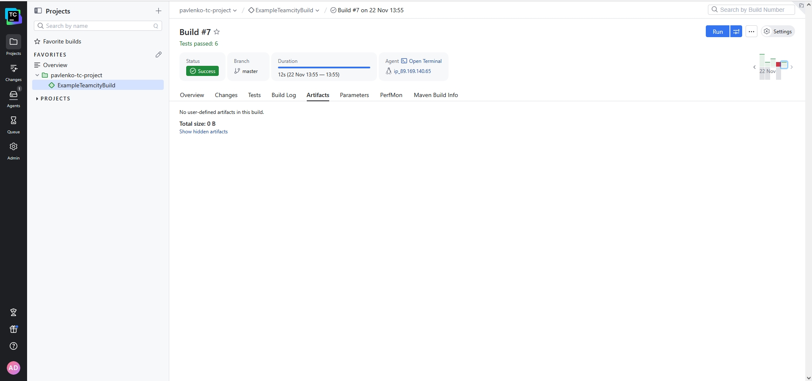

## Повторный build ветки master после merge с добавлением отображения артефактов в Teamcity

---

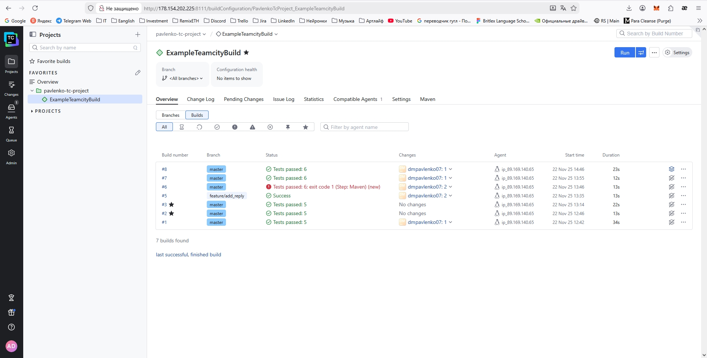
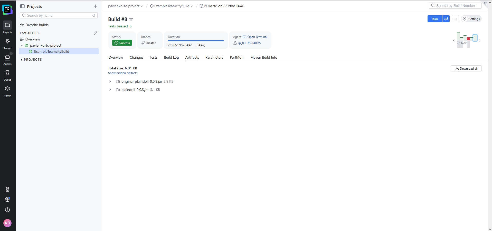
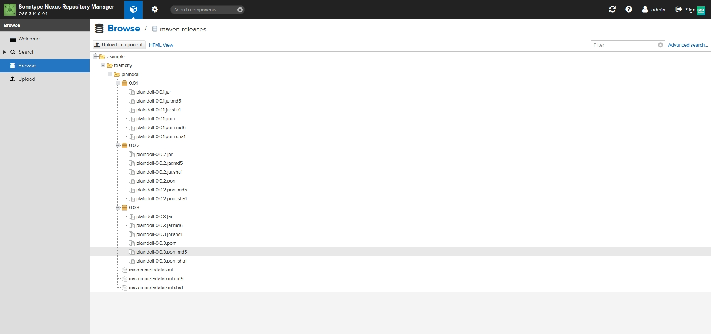
